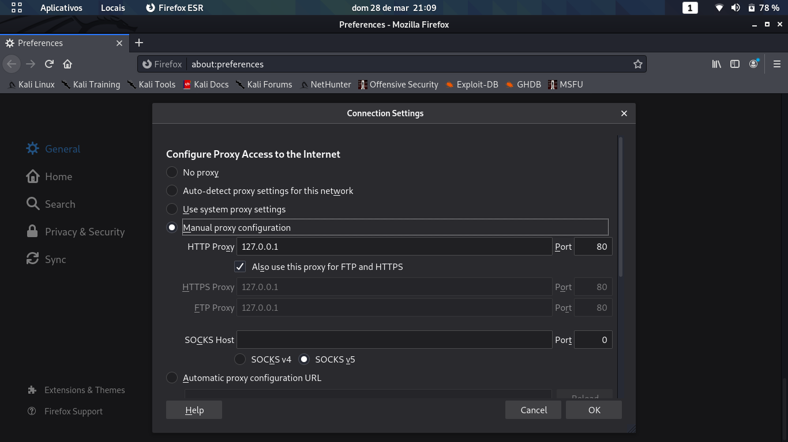

[![Contributors][contributors-shield]][contributors-url]
[![Forks][forks-shield]][forks-url]
[![Stargazers][stars-shield]][stars-url]
[![Issues][issues-shield]][issues-url]


[](./LICENSE)

<br />
<p align="center">
  <a href="https://github.com/othneildrew/Best-README-Template">
    
  </a>

  <h1 align="center">Python Networks</h1>

  <p align="center">
    Programação Python em Redes para dev's, hackers e pentesters.
    <br />
    <br />
    ·
    <a href="https://github.com/joaoluke/python_networks/issues">Reportar Bug</a>
    ·
    <a href="https://github.com/joaoluke/python_networks/issues">Solicitar Recurso</a>
  </p>
</p>

<details open="open">
  <summary>Sumário</summary>
  <ol>
    <li>
      <a href="#o-projeto">Sobre o projeto</a>
    </li>
    <li>
      <a href="#questões-iniciais">Questões Iniciais</a>
      <ul>
        <li><a href="#pré-requisitos">Pré-requisitos</a></li>
        <li><a href="#instalações">Instalações</a></li>
      </ul>
    </li>
    <li><a href="#client-tcp">Cliente TCP</a></li>
    <li><a href="#client-udp">Cliente UDP</a></li>
    <li><a href="#server-tcp">Server TCP</a></li>
    <li><a href="#netcat">Substituindo o Netcat</a></li>
    <li><a href="#proxy-tcp">Criando um Proxy TCP</a></li>
    <li><a href="#ssh-com-paramiko">SSH com Paramiko</a></li>
    <li><a href="#contribuição">Contribuição</a></li>
    <li><a href="#contato">Contato</a></li>
    <li><a href="#reconhecimentos">Reconhecimentos</a></li>
  </ol>
</details>

## O Projeto

Python é a linguagem "queridinha", para os amantes de cibersegurança, e como vamos explorar o conteúdo de um dos maiores best-sellers do assunto (**Black Hat Python**) vamos aprender a fundo sobres as tecnologias e até mesmo construir nossas próprias ferramentas para pentest com Python!

Vamos aprender sobre o capítulo 2, 3 e 4 de Black Hat onde se aborda temas de rede, vamos aprender fazer nosso próprio cliente TCP, UDP, server TCP, vamos fazer um substituto do Netcat, um Proxy, tutelamento SSH, decodificar a camada IP, roubar credenciais de emails, Sniffing e muito mais (vamos deixar de ser apenas um "script kiddies"). Então sente-se confortavelmente e vamos ao haking!

Se você ama programação, ama Python, ama cibersegurança esse conteúdo é para você! Fiz com todo carinho 💜.

## Questões Iniciais

Vamos dar inicio a preparação do ambiente para programarmos, para inicio tenha um computador com acesso a internet, um editor de texto ou IDE (meu conselho é usar o PyCharm versão gratuita), o livro pede para que você instale o Kali Linux em um VM, mas pode ser em qualquer maquina Linux ou até mesmo MacOS, se precisarmos de algum tipo de instalação de pacote vou citar em cada capitulo, fique tranquilo!

Minhas dicas são: pratique cada tema muito, veja bem os exemplos e as referencias externas que irei colocar em cada assunto, busque informações do tema discutido pela internet, se caso tiver alguma duvida específica pode-me mandar por contato ou por no StackOverflow, espero que você tenha curiosidade e comprometimento para absolver cada tópico a fundo, se a principio um exemplo parecer muito difícil, calma e olhe com cuida e sem pressa, pois eu vou comentar cada tópico passo a passo.

### Pré-requisitos

- Maquina Linux (seja VM ou instalada no HD)
- Conhecimento prévio em Python (não vou entrar em detalhes da sintaxe e sim das funcionalidades, então é bom você ter um conhecimento intermediário de lógica de programação e de Python)
- Kali-Linux (opcional)
- Conhecimento de comandos linux
- Python3 instalado em sua máquina (de preferência ser padrão no sistema todo)
- WingIDE (opcional, sugestão do livro)
- Conhecimento básico em redes de computadores (saber como funciona os protocolos podem lhe ajudar muito nessa demo)

Obs.: Coloquei alguns links bacana no Reconhecimento no final do arquivo com alguns conteudo bacana de Redes, comando linux, instalação do PyCharm...

### Instalações

Para instalar o `pip` pra podermos instalar algumas ferramentas que vamos usar use o seguinte comando:

```cmd
sudo apt-get install python-setuptools python-pip
```

Para instalar o Python 3 primeiro verifique se tem alguma versão do Python instalada em sua maquina com o comando:

```cmd
$ which python
```

ou

```cmd
$ which python3
```

que deve retornar algo como `/usr/bin/python`. Isso significa que o Python está instalado nesse endereço.

Para instala-lo com apt-get:

```cmd
$ sudo apt-get install python3
```

```cmd
$ sudo apt-get install python3-pip
```

Para instalar o WingIDE use o comando:

```cmd
$ sudo dpkg -i wingide5_5.0.9-1_i386.deb
```

e

```cmd
$ sudo apt-get -f install
```

## Client TCP

Para enviar alguns dados lixos afim de testar, fazer fuzzing ou qualquer outra tarefa, devemos ter um Cliente TCP de um forma simples

- Importo a biblioteca socket para usarmos socketes bloqueantes.
- Defino meu host e porta a serem conectados.
- Crio um objeto socket com parametro `AF_INET` que me diz que queremos um endereço IPv4 padrão ou um nome host e o `SOCK_STREAM` que indica que esse será um cliente TCP.
- Envio alguns dados a ele.
- Recebo alguns dados.

Obs.: fazendo algumas suposições sérias sobres os sockets em relação aos quais você deveria estar ciente. A primeira suposição é que nossa conexão sempre terá sucesso e a segunda é que o servidor sempre estará esperando que lhe enviemos dados antes (em oposição aos servidores que esperam enviar dados a você antes e esperam a sua resposta), a terceira suposição é de que o servidor sempre enviará dados de volta imediatamente.

## Client UDP

Não sendo muito diferente do client TCP, fazemos apenas quatro pequenas alterações para que os pacotes sejam enviados em formato UDP:

```python
client = socket.socket(socket.AF_INET, socket.SOCK_DGRAM)
```
- Onde `SOCK_DGRAM` indicando um cliente UDP.
- Fazemos um `blind()` para conectar o socket ao esdereço de destino.
- E o `sendto()` passamos os dados e o servidor para qual voce deseja enviar os dados.
- O ultimo passo consiste em chamar o `recvfrom()`para receber de volta os dados UDP.

Obs.: como o protocolo UDP não é orientado a conexão, não há nenhuma chamada anterior a `connect()`. Você Irá observar que quanto os dados quanto os detalhes sobre o host remoto e a porta são recebidos, juntamente com a mensagem UDP que no nosso caso foi `Hello, server UDP`.

Para mais informações sobre a conexão UDP com Python veja o link [UDP exemple](https://pythontic.com/modules/socket/udp-client-server-example)

## Server TCP

Criar um servidor TCP é tão simples quando criar um cliente, porém é necessário atenção para configurar seu server ao seu client, talvez pode dar erros de conexão, pois você pode estar tentando fazer essa conexão em portas reservadas. Preste atenção!

Eis um servidor TCP multithreaded padrão:

- No começo fazemos o que já estamos acostumados a fazer com o `bind()` passando o endereço IP e a porta que queremos que o servidor fique ouvindo.
- Depois com o `server.listen(1)` dizemos ao servidor para começar a ouvir com o máximo de conexões definidas em 1 (opção minha, você pode por quantas você quiser)
- Então com a função `handle_client()` o servidor entra em seu laço principal, em que aguarda uma conexão de entrada.
- Quando o cliente se conecta, recebemos o socket do cliente na variável `client`e os detalhes da conexão remota remota numa variável em `addr` em `client, addr = server.accept()`
- Em seguida criamos um novo objeto thread que aponta para nossa função `handle_client()` e passamos o objeto socket referente ao cliente como argumento `client`
- Iniciamos a thread para que cuide da conexão com o cliente e o laço principal do nosso servidor estará pronto para cuidar de outra conexão de entrada em `client_handler.start()`
- A função `client_handler()` executa `recv()` e, em seguida, envia uma mensagem simples ao cliente "ARK!"

Para mais informações sobre a conexão entre servidor TCP e cliente TCP com Python veja o link [TCP conection exemple](https://pymotw.com/3/socket/tcp.html)

Obs.: É isso, esses códigos serão estendidos (em novos arquivos, para não atrapalhar o versionamento) nas próximas seções, em que desenvolveremos um substituto para o Netcat e um Proxy TCP! Então borá lá!

## Netcat

Chegou a hora de criarmos o nosso próprio canivete suíço das redes: O NETCAT. Muitas das vezes os administradores de rede "espertinhos" removem ele do sistema, mas o python está presente nos servidores.

Então para estes caso é muito útil criar um cliente e servidor simples para rede que possam ser usados para enviar arquivos ou ter um listener (processo que verifica se há solicitações de conexão) que possibilite o acesso

Se você invadiu um sistema web, certamente deveria deixar uma callback Python para ter acesso secundário antes de lançar mão do uso de um de seus cavalos de Tróia ou de suas backdoors (portas dos fundos).

1 - Então vamos começar com nosso Netcat: Calma! O arquivo é grande, eu sei! Mas vamos por partes, vou começar explicando desde o começo:

- Primeiro faço algumas importações
- Depois defino algumas variáveis globais.
- Ai cria a função principal `def usage():`, ela será responsável pelo tratamento dos argumentos da linha de comando pela chamada do restante das funções.

Começando lendo todas as opções de linha de comando:

``` python
try:
opts, args = getopt.getopt(sys.argv[1:], "hle:t:p:cu:",
["help", "listen", "execute=", "target=", "port=", "command", "upload="])
except getopt.GetoptError as err:
logging.error("%s", err)
usage()
```
e definindo as variáveis necessárias de acordo com as opções detectadas. E se alguma informação de comando não atender nossos critérios, vamos exibir informações sobre como usar o script de acordo com nossa função `usage()`.
E aqui tentamos imitar o netcat e enviar dados de stdin pela rede:
```python
f not listen and len(target) and port > 0:
buffer = sys.stdin.read()

client_sender(buffer)
```
E por fim detectamos que é necessário configurar um socket para ouvir a rede e processamos comandos adicionais: `server_loop()` onde carregamos um arquivo, executamos um comando, iniciamos um schell de comandos.

2 - A partir de agora vamos falar da segunda parte do nosso script `def client_sender():`, já estou achando que você está se familiarizando com tudo isso.

- Começamos a criar nosso objeto socket TCP e depois testamos ele.
- Depois o testamos para saber se recebemos algum dado de entrada de stdin.
```python
if len(buffer):
client.send(buffer)
while True:
...
```
- Se tudo estiver ok, enviaremos os dados remotamente e receberemos dados de volta (`while recv_len:`)
- Então preparamos mais dados de entrada (`buffer = input('')`) do usuário e continuaremos a enviar e receber dados até o usuário encerrar nosso script.

3 - Agora vamos criar o laço principal do nosso servidor, além de uma função stub que cuidará tanto da execução do nosso comando quanto do nosso shell de comandos completo.

Bom a essa altura do campeonato você já deve estar bem familiarizado em criar um servidor TCP completo com threading, então não vamos entrar em detalhes da nossa função `server_loop():`

- Algo que tem na função `run_command():` que ainda não falamos sobre é a subprocess, que é uma biblioteca que provê uma interface eficaz para criar processos, proporcionando diversas maneiras de iniciar e interagir com programas clientes.
- Aqui `output = subprocess.check_output(command, stderr=subprocess.STDOUT, shell=True)` simplesmente executamos qualquer comando que seja passado, executando no sistema operacional e retornando a saída do comando ao cliente que se conectou a nós.

4 - Por fim vamos implementar a lógica para fazer upload de arquivos, executar comando e implementar o nosso shell: `client_handler():`

- Nessa primeira porção de código (`if len(upload_destination):`) é responsável por determinar se nossa ferramenta de rede está configurada para receber um arquivo quando uma conexão for estabelecida.
- Inicialmente, recebemos os dados de arquivo em um laço (`while True:
data = client_socket.recv(1024)`) para garantir que recebemos tudo.
- Depois, processamos nossa funcionalidade de execução, que chamamos nossa função `run_command()` e simplesmente envia o resultado de volta pela rede.
- Por fim de tudo temos o código que cuida de nosso shell de comandos, ele contínua a executar comandos à medida que os enviamos e a saída é mantida de volta.

### Testando

Em um terminal ou no shell cmd.exe, execute nosso script da seguinte maneira:

`kali-linux$ ./szynet.py -l -p 9999 -c`

Você pode ir em outro terminal ou cmd.exe e executar nosso script como cliente (igual fizemos com o server e cliente TCP). Lembre-se de que nosso script está lendo de stdin e fará isso até receber o marcador EOF (end-of-file). Para isso, precione CTRL + D em seu teclado:

```cmd
kali-linux$ ./szynet.py -l -p 9999 -c
<CTRL-D>
<BHP:#> ls -la
drwxr-xr-x 4 kali-linux staff 136 18 Dec 19:45 .
drwxr-xr-x 4 kali-linux staff 136 9 Dec 17:34 ..
-rwxrwxrwx 1 kali-linux staff 8498 19 Dec 06:14 szynet.py
-rw-r--r-- 1 kali-linux staff 844 10 Dec 10:45 listing-1-3.py
<BHP:#> pwd
/home/kali-linux/scripts/netcat
```

Obs.: Você vai notar que o código as funções não estão na ordem dos comentários isso por que fiz o comentário de acordo com a importância e o processo que execução do script.

Meus parabéns você chegou ao fim de uma etapa bem difícil espero que tenha entendido o que fizemos e esteja ainda com vontade de aprender mais, pois isso foi só o começo, estamos só aquecendo por enquanto. Agora vamos criar um PROXY TCP que vamos usar em vários cenários de ataque.

## Proxy TCP

Os motivos para se ter um proxy em sua caixa de ferramentas são inúmeros, podemos usar para encaminhar trafego a ser enviado de host, seja para avaliar softwares baseados em rede. Ao realizar testes de invasão em ambientes corporativos, você comumente se deparará com o fato de não puder executar o Wireshark, não poder carregar drivers para fazer sniffing no loopback do Windows... Então vamos criar nosso próprio proxy TCP!

Nosso script contém sete funções vou explicar uma por uma, algumas você já deve estar acostumado.

1 - `server_loop()`

* Essa função você já deve estar bem familiarizado com ela, começamos recebendo alguns argumentos de linha de comando.
* Depois disparamos uma laço no servidor que fica ouvindo à espera de conexões.
* Quando uma nova solicitação de conexão surgir, ela será passada a próxima função `proxy_handler()`

2 - `main()`

* A função principal do nosso script capaz de definir os dados a ser usado e chamar nossa função `server_loop()` com os parâmetros corretos para ficar ouvindo nossa rede.

3 - `proxy_handler()`

* Eis a função de que fará todo trabalho de envio e de recepção de dados para qualquer lado do stream de dados.
* Começamos fazendo uma verificação para garantir que não precisaremos iniciar uma nova conexão.
* Depois usamos nossa função `receive_from()` que será usada uns ambos lados da comunicação
* Depois fazemos um dump do conteúdo do pacote para inspeciona-los e ver se há algo interessante.
* Em seguida passamos a saída para nossa função `response_handler()`.
* O restante é simples: lemos continuamente do host local processamos, enviamos para o host remoto, lemos o host, processamos e enviamos ao host local.

4 - `hexdump()`

* Na última parte do código.
* Inicialmente criamos nossa função de dumping de valores hexa que simplesmente exibirá os detalhes dos pacotes mostrando tanto os valores hexadecimais quantos caracteres ASCII que possam ser exibidos.

5 - `receive_from()`

* A tal função função é usada tanto para receber dados locais quanto remotos e simplesmente lhe passam o objeto socket a ser usado.

6 - `request_handler()` & `response_handler()`

* Nas duas ultima funções permitem modificar qualquer tráfego destinado a qualquer lado do proxy.

### Testando

Bom, para testar você simplesmente pode fazer um comando com os paramentros que ja predefinimos que nossa função receba no prompt antecedendo com o `sudo` pois pode ser que a porta que você escolheu pode ser previlegiada e exige autorizações do usuário root (no meu caso vou colocar na porta 21 para conectar com meu ou nosso cliente TCP) desta forma: 

```cmd
kali-linux$ sudo python3 ./main.py 127.0.0.1 ftp.target.ca 21 True
```

Ou como acho que você quer ser uma pouco mais ousada e abrangente você pode conectar a uma servidor FTP de sua escolha e que realmente vai te responder, como google.com, facebook.com,... Basta configurar o proxy de seu navegador na porta 80 (porta de acesso HTTP) e rode seu código com as modificações igual no exemplo a seguir:

No navegador (no meu caso irei usar o Firefox):

Va em Preferences > Network Settings

 

 Deixe da seguinte configuração e rode o comando:

 ```cmd
 kali-linux$ sudo python3.9 ./main.py 127.0.0.1 80 www.google.com  80 True 
 ```

 E algo assim irá aparecer em sua tela:

 ```cmd
[*] Listening on 127.0.0.1:80
[==>] Received incoming connection from 127.0.0.1:41452

[<==] Received 201 bytes from localhost.
0000   43 4F 4E 4E 45 43 54 20 77 77 77 2E 67 6F 6F 67    C O N N E C T   w w w . g o o g
0010   6C 65 2E 63 6F 6D 3A 34 34 33 20 48 54 54 50 2F    l e . c o m : 4 4 3   H T T P /
0020   31 2E 31 0D 0A 55 73 65 72 2D 41 67 65 6E 74 3A    1 . 1 . . U s e r - A g e n t :
0030   20 4D 6F 7A 69 6C 6C 61 2F 35 2E 30 20 28 58 31      M o z i l l a / 5 . 0   ( X 1
0040   31 3B 20 4C 69 6E 75 78 20 78 38 36 5F 36 34 3B    1 ;   L i n u x   x 8 6 _ 6 4 ;
0050   20 72 76 3A 37 38 2E 30 29 20 47 65 63 6B 6F 2F      r v : 7 8 . 0 )   G e c k o /
0060   32 30 31 30 30 31 30 31 20 46 69 72 65 66 6F 78    2 0 1 0 0 1 0 1   F i r e f o x
0070   2F 37 38 2E 30 0D 0A 50 72 6F 78 79 2D 43 6F 6E    / 7 8 . 0 . . P r o x y - C o n
0080   6E 65 63 74 69 6F 6E 3A 20 6B 65 65 70 2D 61 6C    n e c t i o n :   k e e p - a l
[==>] Sent to remote.
[<==] Received 1775 bytes from remote.
 65 64 69 61 20 6F 6E 6C 79 20 73    0 } } @ m e d i a   o n l y   s
0500   63 72 65 65 6E 20 61 6E 64 20 28 2D 77 65 62 6B    c r e e n   a n d   ( - w e b k
0510   69 74 2D 6D 69 6E 2D 64 65 76 69 63 65 2D 70 69    i t - m i n - d e v i c e - p i
05A0   74 2D 62 61 63 6B 67 72 6F 75 6E 64 2D 73 69 7A    t - b a c k g r o u n d - s i z
05B0   65 3A 31 30 30 25 20 31 30 30 25 7D 7D 23 6C 6F    e : 1 0 0 %   1 0 0 % } } # l o
05C0   67 6F 7B 64 69 73 70 6C 61 79 3A 69 6E 6C 69 6E    g o { d i s p l a y : i n l i n
05D0   65 2D 62 6C 6F 63 6B 3B 68 65 69 67 68 74 3A 35    e - b l o c k ; h e i g h t : 5
05E0   34 70 78 3B 77 69 64 74 68 3A 31 35 30 70 78 7D    4 p x ; w i d t h : 1 5 0 p x }
05F0   0A 20 20 3C 2F 73 74 79 6C 65 3E 0A 20 20 3C 61    .     < / s t y l e > .     < a
0600   20 68 72 65 66 3D 2F 2F 77 77 77 2E 67 6F 6F 67      h r e f = / / w w w . g o o g
0610   6C 65 2E 63 6F 6D 2F 3E 3C 73 70 61 6E 20 69 64    l e . c o m / > < s p a n   i d
0620   3D 6C 6F 67 6F 20 61 72 69 61 2D 6C 61 62 65 6C    = l o g o   a r i a - l a b e l
0630   3D 47 6F 6F 67 6C 65 3E 3C 2F 73 70 61 6E 3E 3C    = G o o g l e > < / s p a n > <
0640   2F 61 3E 0A 20 20 3C 70 3E 3C 62 3E 34 30 35 2E    / a > .   
[==>] Sent to localhost.
[*] No more data. Closing connections.
 ```

Bom isso é tudo pessoal. Vamos para a próxima!

## SSH com  Paramiko

## Contribuição
Os comentários e os códigos foram retirados do livro: Black Hat Python de Justin Seitz publicado pela editora Novatec. Com algumas alterações quando aos comentários e ao código adaptado a versão 3.9 do Python

## Contato

Me mande uma mensagem caso tenha duvidas

<a href="https://blog.rocketseat.com.br/author/thiago/">
 
 <br />
 <sub><b>João Lucas (Instagram)</b></sub></a> <a href="https://www.instagram.com/joaolucas.deoliveira56/" title="Instagram">🚀</a>
 <br />
 
[](https://www.linkedin.com/in/joaolucasdeoliveira56/) 
[](mailto:joao@wavecode.com.br)

## Reconhecimentos

* [ProgrammerSought](https://www.programmersought.com/)
* [HOWTO sobre a Programação de Soquetes](https://docs.python.org/pt-br/3/howto/sockets.html)
* [Instalação do Pycharm](http://pythonclub.com.br/instalando-pycharm-ubuntu.html)
* [Kali-Linux em Virtual Box](https://www.kali.org/docs/virtualization/install-virtualbox-guest-vm/)
* [Comandos Linux](https://www.linuxpro.com.br/dl/guia_500_comandos_Linux.pdf)
* [Guia Básico de Redes](https://www.algosobre.com.br/informatica/redes-de-computadores-nocoes-basicas.html)

[contributors-shield]: https://img.shields.io/github/contributors/othneildrew/Best-README-Template.svg?style=for-the-badge
[contributors-url]: https://github.com/joaoluke/python_networks/graphs/contributors
[forks-shield]: https://img.shields.io/github/forks/othneildrew/Best-README-Template.svg?style=for-the-badge
[forks-url]: https://github.com/joaoluke/python_networks/network/members
[stars-shield]: https://img.shields.io/github/stars/othneildrew/Best-README-Template.svg?style=for-the-badge
[stars-url]: https://github.com/joaoluke/python_networks/stargazers
[issues-shield]: https://img.shields.io/github/issues/othneildrew/Best-README-Template.svg?style=for-the-badge
[issues-url]: https://github.com/othneildrew/Best-README-Template/issues
[product-screenshot]: images/screenshot.png
